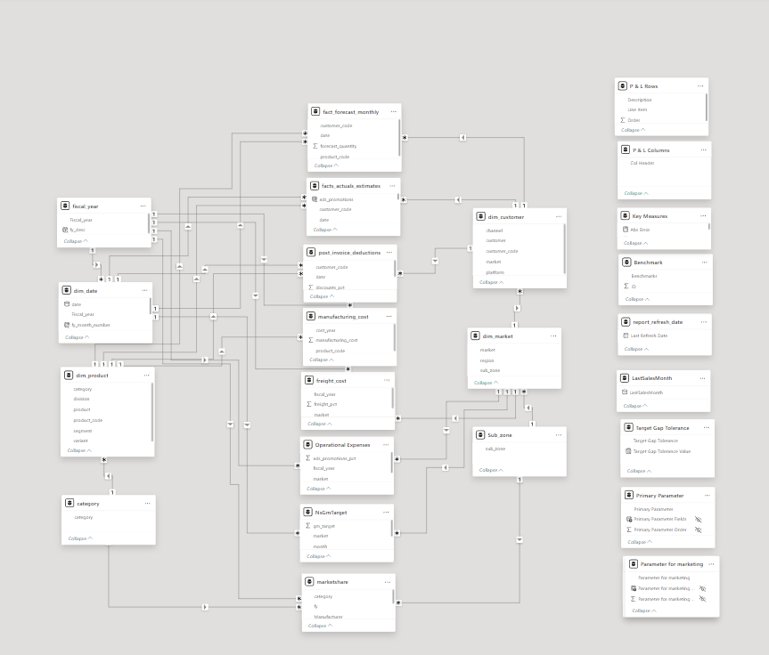

# AtliQ Hardware Business Insights 360

## Title Page
**Project Title**: AtliQ Hardware Business Insights 360  
**Subtitle**: Empowering Business Decisions with Power BI  
**Author**: Suman  
**Date**: December, 2024  
**Live Dashboard Link**: [Dashboard Link](https://app.powerbi.com/view?r=eyJrIjoiNjFjOWFlNjQtZTEyZC00NzYxLWI3NmItZjAwOTM4NDk1NGExIiwidCI6ImM2ZTU0OWIzLTVmNDUtNDAzMi1hYWU5LWQ0MjQ0ZGM1YjJjNCJ9)  

---

## Table of Contents
1. [Project Overview](#project-overview)  
2. [Problem Statement](#problem-statement)  
3. [Objectives](#objectives)  
4. [Datasets Used](#datasets-used)  
5. [Data Modeling](#data-modeling)  
6. [Dashboard Overview](#dashboard-overview)  
7. [Power BI Techniques Learned](#power-bi-techniques-learned)  
8. [Key Business Metrics and Insights](#key-business-metrics-and-insights)  
9. [Challenges and Learnings](#challenges-and-learnings)  
10. [Conclusion and Future Scope](#conclusion-and-future-scope)  

---

## Project Overview
AtliQ Hardware, a global leader in computer and accessories sales, faced financial challenges despite rapid growth and expansion. To address these issues, the company decided to transition to data-driven decision-making using Power BI to identify actionable insights across finance, sales, marketing, and supply chain operations.

---

## Problem Statement
After opening a new store in America, AtliQ Hardware encountered unforeseen losses due to ineffective decision-making based on intuition and limited data analysis. Competitors with advanced analytics teams posed a significant threat, urging AtliQ Hardware to enhance its analytics capabilities.

---

## Objectives
- Implement a centralized analytics solution using Power BI.  
- Provide stakeholders with actionable insights for strategic decision-making.  
- Analyze and visualize data across multiple departments:  
  - **Finance**: Profit and loss statements, product analysis, and net sales trends.  
  - **Sales**: Customer and product performance.  
  - **Marketing**: Segment-wise profitability.  
  - **Supply Chain**: Forecast accuracy and operational efficiency.  
  - **Executive Summary**: High-level metrics for leadership.

---

## Datasets Used
### Sources
- **MySQL Database**: Essential facts and dimensions.  
- **Excel/CSV Files**: Supplementary data such as targets and market share.

### Tables
- **dim_customer**: Customer details.  
- **dim_market**: Market regions.  
- **dim_product**: Product details.  
- **fact_sales_monthly**: Monthly transaction data.  
- **fact_forecast_monthly**: Forecast data for demand planning.  
- **freight_cost**: Logistics costs.  
- **gross_price**: Revenue data.

---

## Data Modeling
- **Schema**: Snowflake Schema for optimal performance and scalability.  
- **Key Steps**:  
  - Importing data from MySQL into Power BI.  
  - Cleaning and transforming data in Power Query.  
  - Establishing relationships between tables.  
  - Creating calculated columns and measures.  

---

## Dashboard Overview
The Power BI dashboard consists of six pages, each targeting a specific business domain:

1. **Home Page**: Navigation hub with bookmarks.    

    

2. **Finance**: Profitability metrics, top-performing products, and customers.  
   
   
   
3. **Sales**: Customer contributions, gross margin, and sales trends. 

   

 
4. **Marketing**: Segment-wise performance and profitability.  

   

5. **Supply Chain**: Forecast accuracy and error analysis.  

   

6. **Executive Summary**: Key KPIs, revenue breakdowns, and geographical performance.  

   

---

## Power BI Techniques Learned
- Data modeling with Snowflake schema.  
- Writing DAX measures and calculated columns.  
- Using advanced visualizations like KPI indicators, dynamic titles, and conditional formatting.  
- Bookmarking for navigation.  
- Implementing Row-Level Security (RLS).  
- Publishing and sharing dashboards via Power BI Service.  

---

## Key Business Metrics and Insights
- **Finance**: Top products by net sales, profitability analysis, and P&L trends.  
- **Sales**: Customer performance, gross margin, and regional analysis.  
- **Marketing**: Segment-wise profitability and net profit percentages.  
- **Supply Chain**: Accuracy of demand forecasts, reducing overstock and wastage.  
- **Executive View**: Comprehensive overview for leadership decision-making.  

---

### **Challenges and Learnings**

#### **Challenges:**

1. **Handling Duplicate Subzones**  
   Duplicate subzone values in the `marketshare` and `dim market` tables led to incorrect calculations and inconsistencies in the data model.

2. **DAX Calculations for Market Share**  
   Writing DAX measures for market share was challenging, as the formula initially returned identical values for all subzones due to data model issues.

3. **Data Cleaning and Transformation**  
   Cleaning large datasets with missing or inconsistent values was time-consuming, especially when multiple tables were involved.

#### **Learnings:**

1. **Resolving Many-to-Many Relationships**  
   Learned how to handle many-to-many relationships using reference tables and DAX functions like `ALLNOBLANKROW` to ensure accurate calculations.

2. **Mastering DAX for Metrics**  
   Gained experience in writing DAX formulas for complex metrics, learning the impact of syntax changes on results.

3. **Importance of Data Cleaning**  
   Realized that systematic data cleaning is crucial for ensuring consistency and reliable insights.

4. **Power BI Data Modeling**  
   Learned how to design structured data models in Power BI, improving report performance and interactivity.

5. **Reporting with Excel and Power BI**  
   Developed skills in creating user-friendly reports with Excel and Power BI to visualize trends and communicate key insights effectively.
 

---

## Conclusion and Future Scope
### Impact
The dashboard provided AtliQ Hardware with a unified analytics platform, enabling informed decision-making and addressing financial challenges.

### Future Scope
- Implementing predictive analytics using AI visuals.  
- Expanding dashboard capabilities to include additional business functions.  
- Automating reporting through integration with other tools.

---

## Tools Used
- **SQL**: For data extraction and manipulation.  
- **Power BI Desktop**: For dashboard creation and visualization.  
- **DAX Studio**: For file size optimization.  
- **Excel/CSV**: For data preprocessing.  
- **Power Query**: For data cleaning and transformation.  
